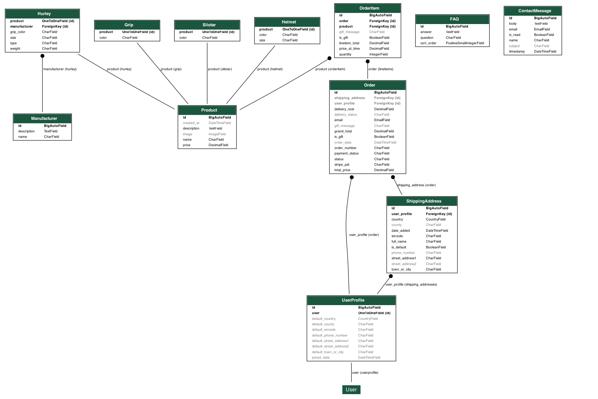

# GAA_STORE

Live Link: https://gaastore-2f38a7e53edc.herokuapp.com/

Link to Kanban Board:  https://github.com/users/Viki-coding/projects/9/views/1?layout=board

## Additional Documentation

- [SEO and Marketing Document](seo-marketing.md)
- [Testing Document](TESTING.md)
  
Table of Contents

## Table of Contents

- [GAA\_STORE](#gaa_store)
  - [Additional Documentation](#additional-documentation)
  - [Table of Contents](#table-of-contents)
  - [Introduction](#introduction)
      - [Description - Project Purpose](#description---project-purpose)
      - [CRUD](#crud)
          - [Create](#create)
          - [Read](#read)
          - [Update](#update)
          - [Delete](#delete)
          - [CRUD to FAQ for admin user](#crud-to-faq-for-admin-user)
  - [User Personas:](#user-personas)
  - [Business and Customer Goals](#business-and-customer-goals)
  - [Kanban Board](#kanban-board)
      - [Kanban Board Progress:](#kanban-board-progress)
  - [UX](#ux)
  - [USER STORIES](#user-stories)
  - [Database Construction](#database-construction)
  - [Design Choices](#design-choices)
  - [Colour Scheme](#colour-scheme)
      - [Typography](#typography)
  - [Wireframes](#wireframes)
  - [FEATURES](#features)
    - [Navigation Bar:](#navigation-bar)
      - [Sign Up Feature:](#sign-up-feature)
      - [Save Shipping Addresses:](#save-shipping-addresses)
      - [Gift Message:](#gift-message)
      - [Hurleys](#hurleys)
      - [Accessories:](#accessories)
      - [How To Measure:](#how-to-measure)
      - [FAQ:](#faq)
      - [BAG:](#bag)
    - [FOOTER FEATURES:](#footer-features)
      - [Facebook:](#facebook)
      - [Privacy Policy](#privacy-policy)
      - [Contact Us](#contact-us)
      - [Mailchimp Signup](#mailchimp-signup)
  - [Security](#security)
      - [Interaction](#interaction)
  - [Error Handling](#error-handling)
      - [404 Page](#404-page)
      - [500 Page](#500-page)
  - [Future Implementation Section:](#future-implementation-section)
  - [Accessibility:](#accessibility)
  - [WAVE:](#wave)
  - [Lighthouse Testing](#lighthouse-testing)
  - [Technologies Used:](#technologies-used)
  - [Deployment Steps:](#deployment-steps)
  - [How to Fork:](#how-to-fork)
  - [How to Clone:](#how-to-clone)
  - [Heroku Deployment:](#heroku-deployment)
      - [To add other dependencies:](#to-add-other-dependencies)
  - [Stripe Connection:](#stripe-connection)
  - [Acknowledging Contributions \& Credits](#acknowledging-contributions--credits)
  - [Media/Images](#mediaimages)
  - [CONTENT](#content)
  - [Legal \& Ethical Compliance](#legal--ethical-compliance)

## Introduction

#### Description - Project Purpose
Gaelic Games in Ireland is an integral part of every townland, parish, village, town, city and county in Ireland and now farther afield.  This site aims at show casing a large variety of different hurleys made by different manufactures and different materials, such as ash and bamboo and goalie hurleys, to allow the customer to quickly view and purchase hurleys, sliotars and hurley grips and hurley helmets.  Currently, there are individual hurley makers or sports shops who only sell one particular type of hurley and do not show the range available in Ireland from a number of different hurley makers. 

There will be an FAQ section to highlight frequently asked questions, such as why metal bands are used.  We will have a hurley size calculator where a user can enter their height, the height to their hip and the hurley calculator will tell you what size hurley is appropriate.  The customer will be able to add items to their basket, they will be able to select the size of the particular hurley they require, a success message will appear when they successfully add an item to their basket. when they add to their basket a display will appear at the bottom of other items to 'bundle' other items in for a deal.  When they log on to the site, a pop up will appear offering 5% off their first order when they enter their email address. There will be mail chimp newsletter.  There will be a privacy policy.  There will be a 404 page. Once the customer has added items to their shopping cart, they will proceed to checkout section, where they will enter their payment details for stripe to process,  there will be a remember me tick box so the customer can set up an account profile where they can view their orders. During each process, success or warning messages will be displayed. 

#### CRUD
User will be able to REGISTER as a user on the site
User will be able to LOGIN

###### Create
User will be able to create a profile and add a number of shipping address to their profile. 

###### Read
User will be able to view their saved shipping addresses and view previous orders. 

###### Update
User will be able to change or edit their saved shipping addresses. 

###### Delete
User will be able to delete saved shipping address. 

User will get feedback on all CRUD functionality. 

###### CRUD to FAQ for admin user
Shop owners will be able to log in if they have staff/superuser status. They will be able to navigate to the FAQ section where they can perform CRUD on the FAQ. 

## User Personas:

---

**Persona 1: The Dedicated Player**
Name: Liam Murphy

**Age:** 25

**Occupation:** Accountant

**Background:** Liam plays hurling competitively for his local club and is devoted to improving his skills on the field. He trains and plays matches regularly during the season and often needs replacement gear quickly.

**Goals:** To easily find high-quality hurleys and sliotars and receive next-day delivery after breaking his hurley during matches.

**Challenges:** Balancing his busy work life with the demands of his hurling schedule.

---

**Persona 2: The Supportive Parent**
Name: Siobhán O'Connell

**Age:** 40

**Occupation:** Teacher

**Background:** Siobhán’s 12-year-old son plays hurling for his school team, and she wants to ensure he has the best gear available. She likes to research products thoroughly and read customer reviews before making purchases.

**Goals:** To purchase durable and appropriately sized hurleys for her son, along with helmets and grips for safety.

**Challenges:** Managing her budget while providing her son with high-quality gear.

---

**Persona 3: The Gift Buyer**
Name: Aoife Byrne

**Age:** 32

**Occupation:** Graphic Designer

**Background:** Aoife is buying a birthday gift for her cousin, who plays hurling. She isn’t familiar with hurley sizes or materials but wants to find a meaningful and practical gift.

**Goals:** To bundle items like hurleys, sliotars, and grips into a gift set with a discount.

**Challenges:** Navigating the site as someone unfamiliar with the sport and its equipment.

---

**Persona 4: The Aspiring Camogie Player**
Name: Emily Ryan

**Age:** 18

**Occupation:** University Student

**Background:** Emily plays camogie for her college team and is passionate about her sport. She loves exploring innovative gear, like hurleys made with bamboo, to enhance her performance.

**Goals:** To use the hurley size calculator to find gear tailored to her height and hip measurements.

**Challenges:** Staying within her student budget while getting high-quality gear quickly.

---

**Persona 5: The Busy Coach**
Name: Seán McCarthy

**Age:** 45

**Occupation:** Sports Coach

**Background:** Seán coaches both hurling and football teams at his local club. He often needs to bulk-purchase equipment for training sessions and matches.

**Goals:** To quickly order large quantities of footballs, rebound posts, and hurleys for his teams and receive them on time.

**Challenges:** Ensuring all purchases are efficient and cost-effective while managing a tight team schedule.

---

## Business and Customer Goals
This site will be valuable for customers who want to buy a hurley and accessories fast from a particular manufacturer. Some of the benefits of this site are outlined in the user personas above. We also include some relevant FAQ and How to Measure Guides.  

The needs of customers are met by offering a wide range of hurleys from different manufacturers in a one stop shop.  The store is easy to navigate around and offers informed descriptions about each product. 

Our full Business and Marketing.md file can be found here: [SEO and Marketing Document](seo-marketing.md)

## Kanban Board

I found the Kanban very helpful, it did take time to set up, it was well planned and structured. I sometimes have a tendency to go from one area and then get distracted to start fixing another area, having the Kanban board with the user stories and the tasks that I needed to perform helped me to keep a structured approach to coding. I learnt that at the end of a commit if I put "relates to #1" etc it would be documented with the task # in my project. Live link at top of readme and made public.

#### Kanban Board Progress:

## UX

When you land on our site it is immediately obvious what the site is and conveys the message of passion about the sport of hurling with the iconic hero image of a helmet and hurl.  Hurling is a historic and deep rooted game and lifestyle in Ireland. 

The site is easy to navigate, there is an immediate call to action button 'Shop for Hurleys Now'. 

Users can view products and add and remove items from their bag, there is feedback provided for each action.  

Forms fields that are filled out incorrectly are highlighted to the user. 

When an item is added to the bag the bag icon appears a light blue. 

When a user is logged in there is a 'Hello name' on the nav, offering a sense of respect and trustworthiness. 

When a user clicks on the different hurley manufactures, a description of that manufacturer is offered to the user so they can make informed decisions of the hurley they would like. 

The user has the ability to choose the correct size hurl and colour using a drop down arrow. 

When the users click on their bag they have the option to see and adjust the items in the bag and continue shopping or proceed to checkout. 

## USER STORIES

**Epic 1: Product Showcase & Navigation**
#1:As a customer, I want to browse a variety of hurleys by material and manufacturer so that I can find the perfect match for my needs.
#2: As a user, I want filters for size and material so that I can narrow down my search quickly.

**Epic 2: Hurley Size Calculator**
#3: As a player, I want a hurley size calculator graphic that recommends the ideal size based on my height and hip measurements so that I can improve my performance. 

**Epic 3: Shopping Cart**
#5: As a user, I want success messages to appear when I add items to my cart so that I know my action was completed successfully.

**Epic 4: Checkout & Payment**
#6: As a customer, I want to complete the checkout process easily so that I can quickly finalize my purchase.
#7: As a user, I want warning messages for incomplete or invalid inputs during checkout so that I can fix errors.

**Epic 5: Customer Engagement**
#9: As a customer, I want to sign up for Mailchimp newsletters so that I can stay updated on deals and new products.
#10: As a customer, I want to be able to contact the store easily through an online contact us form. As a shop owner or staff I can log into the admin and check if contact messages have been ticked and dealt with. These records also provide a valuable resource of the common queries that are asked which can be used to update the FAQ. 

**Epic 6: Additional Features**
#11: As a customer, I want an FAQ section to find answers to common questions so that I can make informed purchases.
#12: As a user, I want a privacy policy page so that I feel confident my data is secure.
#13: As a website visitor, I want a custom 404 page to redirect me gracefully if a link is broken.
#14: As a user I want the ability to create a profile and create some shipping addresses, when I return to buy my next hurley or accessories my shipping details will be saved. 

**Epic 7: Homepage Design and Structure**
#15: As a user, I want a visually appealing homepage with hurling imagery, navigation, and footer so that I can quickly find what I’m looking for and feel immersed in the theme of Gaelic games.

**Epic 8: User Profile Creation and Order Management**
#16: As a user, I want to create a profile during my first purchase so that I can log in later and view my order history and shipping addresses.

**Epic 9: FAQ Management**
#16: As a manager or superuser, I want to log in and have CRUD (Create, Read, Update, Delete) functionality for the FAQ page. 

## Database Construction

The database for GAA Store is designed to be flexible and scalable, supporting a variety of product types and user interactions.

- **Product Model:** A base Product model is used to represent all products in the store. Specific product types (Hurley, Helmet, Grip, Sliotar) are implemented as separate models with a one-to-one relationship to Product, allowing for unique attributes per product type.
  
- **Manufacturer Model:** Linked to Hurleys to track the maker of each hurley.
  
- **User Profiles:** Each user can create a profile, save multiple shipping addresses, and view their order history.
    
- **ShippingAddress Model:**
Stores multiple shipping addresses for each user profile, including fields for name, phone, address lines, town/city, county, eircode, country, and a flag for default address. This allows users to manage and select from saved addresses during checkout.

- **Order Model:**
Represents a user’s order, linking to the user profile and a selected shipping address. Tracks order number, email, order date, total price, Stripe payment ID, status fields (order, payment, delivery), gift options, delivery cost, and grand total. Includes methods to generate unique order numbers and update totals.

- **OrderItem Model:**
Represents each product in an order, linking to the order and product, with fields for quantity, price at time of order, gift options, and the calculated line item total.
  
- **FAQ and Contact Models:** Allow for CRUD operations on FAQs and storage of customer contact messages.

This structure was chosen to allow easy expansion (e.g., adding new product types) and to keep the database normalized and maintainable. The use of one-to-one and foreign key relationships ensures data integrity and efficient queries.

##ER Diagram:

This was my first draft of my models which I changed: 

**Project ERD**
Data model overview

We have a central Product model with a FK to Manufacturer, and four specialized product tables (Hurley, Grip, Sliotar, Helmet) linked one-to-one for their unique attributes.

The Order model captures each checkout, with OrderItem line entries pointing back to Product. Orders reference a ShippingAddress, which in turn belongs to a UserProfile tied one-to-one to Django’s User.

We also store simple site content in FAQ and ContactMessage tables.

My three custom models were - Stored Shipping Address, Contact and FAQ.

## Design Choices

**1. Captivating Homepage**

Hero Image I have incorporated a high-quality hero image of a hurley and helmet
I am using  taglines like "Your Ultimate Source for Gaelic Games Gear." This aligns with my user persona profiles of Liam Murphy (The Dedicated Player) and Emily Ryan (The Aspiring Camogie Player).

I have a dynamic Call-to-Actions (CTAs): "Shop Now" "Find Your Perfect Hurley" prominently featured on the homepage.
I am engaging users with the FAQ and the How to Measure pages. 

**2. Clear Navigation and Layout**

Simple and Intuitive Menu, the navigation bar is clearly labelled with categories like "Hurleys" "Accessories" "FAQ" and "How to Measure."

The site uses responsive design, ensuring seamless usability across devices for parents like Siobhán O'Connell (The Supportive Parent) who may browse on mobile.

I have used sticky navigation to keep the navigation bar accessible as users scroll down for ease of movement between sections.

**3. Tailored Product Display**
Included in the site is filter options for material (e.g., ash or bamboo), manufacturer, size, and price to suit gift buyers like Aoife Byrne (The Gift Buyer).

**4. Enhanced Shopping Cart Experience**
Mini Cart Preview: I display a preview of the cart when items are added to confirm selections, along with success messages.

**5. Engaging User Features**
We have a Profile Dashboard: For logged-in users like Seán McCarthy (The Busy Coach), display a personalized dashboard to view order history, manage orders, and edit profiles.

**6. Specialized Tools and Calculators**
Hurley Size Calculator: This feature is visible on both the homepage and the product pages. 

FAQ Section: The FAQ questions are displayed them with collapsible dropdowns for quick navigation.

**7. Admin and Superuser Features**
Admin Login: We have created an user friendly dashboard for shop owners / staff to create, edit and delete FAQ

**8. Encouraging Engagement**
Mailchimp Integration: We have created an easy to subscribe field on the footer of the site. 

Social Media Integration: Displays our Facebook clickable icon in the footer to foster community engagement.

## Colour Scheme

Using a colour contrast checked we checked which font colours stood out best against our base colours. All receiving good ratings. Graphic illustrated below:

Color-contrast-good

#### Typography
Font used is Roboto from Google Fonts. It is in the sans serif family, is clean with a modern appearance. It is dyslexic friendly helping with readability.

## Wireframes

## FEATURES
Feature Title / Screenshot / Value to the User

### Navigation Bar:

Login/Signup Feature If you already have a username and password you can log in easily to view your profile and saved shipping addresses and any previous orders. Once logged in the button says "Hello <user>", if you click this it takes you to your User Profile Page and a Log Out button appears. When you go to log out an alert modul asks if you are sure you want to log out.

#### Sign Up Feature:

If you are a new user, it is easy to navigate to the Sign Up form, enter your details and password being set up within seconds, the 'Login' button changes to 'Log Out' and you have access to your profile and orders.

#### Save Shipping Addresses:

If you log in as a user, you can navigate to your profile page and add a number of shipping addresses which will be kept and assoicated with you when you log in. When you go to checkout your stored shipping address can be accessed from the drop down arrow. You can have multiple shipping addresses so if you are a grandfather shipping hurleys to different grand children or a coach shipping to a different address this is a very handy feature.

#### Gift Message:

When you navigate to the bag page you have the option of ticking the message box and adding your personal message, once the order is processed your message is displayed on the Thank you for your orde page and will be printed for delivery with your order. 

#### Hurleys 
This site sell hurleys, if you want a hurley you click on the hurley section on my main nav bar, this displays 3 categories of hurleys, Ash/Bambu/Goalie. 

#### Accessories:
Accessories such as helmets, sliotars and grips. Easily navigable from the nav bar and you can add items to your bag quickly. 

#### How To Measure:
Many parents new to the game may not understand how to measure their child for the correct size hurley or helmet. By clicking on this How to Measure nav bar heading takes you to our page giving expert advice on how to do it.  Note also the useful converter calculator that converts cms into inches which is what hurls are measued in!

#### FAQ:
Our FAQ is easy to navigate from the nav bar and details important and informed advice on everything associated with hurling and camogie. 

#### BAG: 

### FOOTER FEATURES:

#### Facebook:
Link to Facebook to enhance user enhancement and communication. This allows the user to access the GAA Store socials in a new page.
We use the attribute rel="noopener noreferrer" in the anchor tags to enhance security and protect against security vulnerabilities.

#### Privacy Policy 
We have created a privacy policy with a link here to the privacy policy statement. 

#### Contact Us
Easy to user contact form which a user can enter and then staff can view and deal with messages in the django admin. All messages are kept making it a valuable souce for compiling relevant FAQ's

#### Mailchimp Signup
We have created a mailchimp sign up with an input field where you can input your email and sign up easily. 

## Security

In a world where cyber security threats are on the increase, we ensured the following was present on our site: 

As well as the rel="noopener noreferrer" in the anchor tags of our external links other security measures in our app include:

Authentication and authorization of our users using django framework
Using the CSRF protection tokens in our forms
Error handling such as creating our 404 page and 500 page
Using djangos password validators
Using djangos security middleware settings.
Only authenticated users can edit delete their shipping addresses and profiles.
Only authenticated staff can create, view, edit, delete the FAQ.

#### Interaction
Whenever a user interacts with our site, they get immediate feedback messages and confirmations.

When a user adds something to their shopping bag, deletes something in their shopping bag or makes an input error - a message is displayed to keep them informed.

## Error Handling
USed RegexValidator to validate telephone number input field
Django forms has server-side error handling for fields. 

#### 404 Page
We have created a 404 page so that user of accidentally enters a typo in the address they get an opportunity to be redirected back to the home page: 404 page 
When a user attempts to book an event who’s capacity has already been reached, i.e. the event is already booked out, a message is displayed to let them know event capacity has been reached:

#### 500 Page 

## Future Implementation Section: 

 - I would like when a user logs onto their profile that they see the item they bought - but also the item details such as colour and size if applicable. I would modify my order item model. Unfortunately I just ran out of time on this occasion. 
 - I would like to add a reviews section
 - I would like to add prompts such as customers who bought this also bought ... 
 - Implement functionality for password reset via email
 - Implement a wish list feature 
Future: Add color-coded statuses for products (e.g., "In Stock," "Low Stock"). under admin superuser section
User testimonials from All Ireland and county players
- Currently if a new user completes their address and details at checkout and ticks the remember me box, their email and gmail is remembered and when they click into their user profile, their order is there but not the address they first used.  I would like to update that. 
- When a user logs in - I would like them to be able to go to their user profile and see the status or their order whether its pending, processed, out for delivery etc.
- Update sliotars products so you can choose different colors from dropdown, ran out of time to fix it this time"

## Accessibility:

Accessibility of the site is very important.

(a) Semantic HTML elements were used to provide meaningful structure to the content.

(b) Keyboard Navigation ensures all interactive elements like the form fields and buttons are accessible via the keyboard.

(c) Using Text Alternatives using Aria labels to describe content were used to improve accessibility for screen readers.

(d) Colour Contrast: The colour pallet chosen has sufficient contrast against the background to be readable by users with visual impairments.

(e) All forms were accessible with associated labels to provide clear instruction and are navigable using keyboard.

(d) Alt attributes were used to describe any image content such as the logo and notice board image.

(e) Testing, we used WAVE a Web Accessible Evaluation Tool to analyse the page and made adjustments to the site to try to improve it. 

## WAVE:

WAVE evaluation results

## Lighthouse Testing

Lighthouse test results

## Technologies Used:

* HTML
* CSS 
* JS 
* Python
* Django
* Bootstrap
* Heroku
* Postgres Database
* Stripe 
* Frameworks, Libraries and Programs Used:
* Balsamiq Wireframes - used to create wireframes
* Git - version control
* Visual Studio Code
* Git Hub - To save and store the files for the website
* Google Fonts - to import fonts onto the website
* Font Awesome for iconography on website
* Favicon.io - to create favicon
* Coolors - checking colour pallets and their contrast abilities with fonts.
* Berme.net - to reduce image sizes and convert to .webp
* Canva - to create logo image
* Am I Responsive - quick tool to check how responsiveness on various devices and creates display
* Responsive tool - (https://responsivetesttool.com/)
* Screen Shot of site on various screens (https://techsini.com/multi-mockup/)
* JSHint to check JS code
* Spell Check
* Heroku
* Pylint
* FigJam - to create ER diagram
* Figma - to crate wireframes
* Converting tabel to markdown (https://tabletomarkdown.com/convert-spreadsheet-to-markdown/)
* Whitenoise
* Cloudidnary
* Perplexity for trouble shooting 
* dbdiagram.io - For creation of ERD diagram 
* https://www.vecteezy.com - used for images 
* https://temp-mail.org/en/
* Mailchimp 
* Stripe 
* Privacy policy generator (https://www.privacypolicygenerator.info/)
* Site map generator: (https://www.xml-sitemaps.com/)
* Pygraphviz to create ERD 

## Deployment Steps:

* The site is Deployed using GitHub Pages
* Login to GitHub
* Go to the projects repository (https://github.com/Viki-coding/community)
* Click on Settings
* Select pages in the left navigation bar
* From SOURCE dropdown select Deploy from a Branch
* Under BRANCH from dropdown select Main Branch and SAVE
* The site is now deployed but may take a few minutes to go live.
* Return to CODE tab of Github repo and wait a few minutes for build to finish, refresh page. This * will show on GitHub-pages to see active deployments.

## How to Fork:

* Login to Github
* Go to Project repository
* Click the FORK button top right corner

## How to Clone:

* Log into Github
* Go to project repository
* Click on the code button, select what want to clone HTTPS, SSH or GitHub CLI and copy the link.
* Open the terminal in your code editor and change the current working directory to the location you want to use for the cloned directory
* Copy 'git clone' into the terminal and paste the link you copied in step 3. Press enter.

## Heroku Deployment:

* Log on to Heroku (https://dashboard.heroku.com/apps)
* Select “Create new app”
* Name the app something unique
* Choose Europe from the dropdown
* Click ‘Create App’
* Go to the SETTINGS tab first
* In the ‘Config Vars’ section aka environment variables
* In the KEY section type in PORT and the value section type in 8000 – add
* IF you build a landmark project that doesn’t use a cred.json file you don’t need to set up config vars otherwise:

* In the KEY section type CREDS (all capital letters) –
* Go to workspace and copy the entire creds.json file and paste it into the value field and add.
  
  #### To add other dependencies:

*ADD BUILDPACK*
* Select Python – choose add
* Select Node.js – choose add
* NOTE: (Should be in this order, python first then node.js)

*DEPLOY SECTION:*

* Click on the DEPLOY Tab
* Choose the Githb deployment method
* Confirm that you want to connect to GitHub, gitbub will request your password to connect.
* Click in repo name and Search for your repository name and select connect.
* Select Enable Automatic Deploys
* Check Choose a branch to deploy is defaulted is MAIN
* Click on Display Branch
  
App will build:

* Wait until the message ‘App was successfully deployed’ is displayed,
* Click on the view button

## Stripe Connection: 

* Sign up for a Stripe account if you don’t have one.
* In the Stripe dashboard, get your test and live API keys (Publishable key, Secret key, and Webhook secret).
* Add your Stripe keys to your environment variables or env.py:
    - STRIPE_PUBLIC_KEY
    - STRIPE_SECRET_KEY
    - STRIPE_WH_SECRET
* Install the Stripe Python package:
    - pip install stripe
* In your Django settings, load the Stripe keys from environment variables.
* Use the Stripe keys in your checkout/payment views and templates.
* Set up your webhook endpoint in Stripe to point to /checkout/wh/ (or your webhook URL).
* In your Django project, implement a webhook handler to process Stripe events.
* Test payments using Stripe’s test card numbers (e.g., 4242 4242 4242 4242).
* When ready for production, switch to your live Stripe keys.

## Acknowledging Contributions & Credits

CI - Boutique Ado - Walk through project
The user of the boiler plate from the boutique ado was very helpful for the main structure of the project. I customised from this. 

CI [Portfolio Project 5 - Ecommerce: The guide to MVP] video was very useful. 

CI [eCommerce & Stripe] - Paul outlining some of the stripe implementation 

CI [Community Q&A: PP5 eCommerce Project FAQ]

https://www.w3schools.com/howto/howto_js_accordion.asp
Found this useful when creating my FAQ page to create an accordion style FAQ section. 

https://dbdiagram.io/ - Excellent for planning my ERD 
At my first meeting with my mentor, I showed him my ERD diagram, he didn't think my model approach would work with my products the way I had it mapped and suggested to use the abstract-base-model as detailed here: 
https://realpython.com/modeling-polymorphism-django-python/#abstract-base-model

https://www.w3schools.com/django/ref_tags_verbatim.php
Found this W3 schools helpful for explaining about verbatim template tags when my JS was causing errors on my product detail template. 

Understanding tags in django
https://docs.djangoproject.com/en/5.2/ref/templates/builtins/

Stripe documentation 
https://docs.stripe.com/payments/accept-a-payment?platform=web&ui=elements

Webhooks
https://docs.stripe.com/webhooks/quickstart

[how-to-redirect-superuser-to-specific-page-in-django](https://stackoverflow.com/questions/68572107/how-to-redirect-superuser-to-specific-page-in-django)

MARKDOWN:

Help with markdown, found this site useful (https://www.markdownguide.org/basic-syntax/) and downloaded this extension to Visual Studio Code (https://marketplace.visualstudio.com/items?itemName=yzhang.markdown-all-in-one#table-of-contents)

We gained inspiration with the READ.me by watching the video 'Creating your README' on CI Chanel Lead Library on YouTube and also the video with Lane-Sawyer Thompson on CI Channel on YouTube. Thanks to the on-line tutor, Oisin and Alan for their expertise and ability to explain some of the 'challenges' I encountered. Thanks to our very supportive and positive facilitator Kay and my Kiwi mentor Dick Vlaanderen. Also found the webinar 'Community Q&A: How to Troubleshoot with Lane-Sawyer Thompson' very helpful approach to how to view looking at the site for bugs and methodically identifying issues.

CI - Community Q&A: PP5 eCommerce Project FAQ's video with the accessor Lucy. 

## Media/Images

Images used from 
https://www.vecteezy.com and edited in canva. 
Elverys 

## CONTENT

Hurley size: https://learning.gaa.ie/sites/default/files/info_hurl_FINAL.pdf
How to measure for a hurley and helmet content from: https://www.elverys.ie/pages/how-to-measure-for-a-hurley-buying-guide
Hurley measure guide from: https://camogie.ie/files/Hurl%20Size%20Poster.pdf

## Legal & Ethical Compliance
This project is for educational purposes only.

